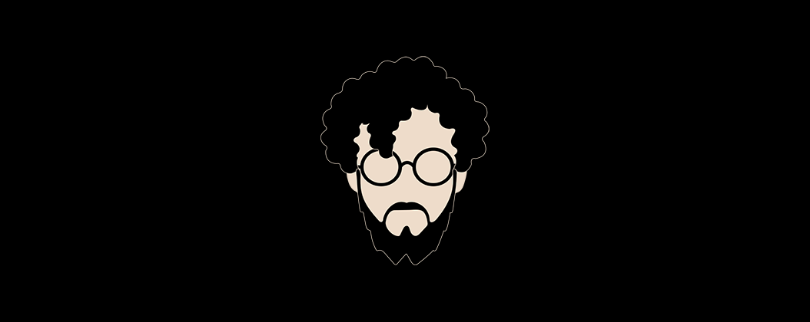

### Hi humans and robots ✌️

My name is Moises I'm Software architect and Software Engineer, I love writing 👨🏻‍💻 code and playing the guitar 🎸. This is my Github and my portfolio, here has my personal projects.

In my free time I maintain and create Open-Source projects for the community and Closed-Source for Companies. Take a look at my projects.

```Java
return projects.stream().filter(p -> p.getType().equals("portfolio"))
    .collect(Collectors.toList());
```
- **[Arron Edi](https://github.com/moisesarrona/arron-edi)** - A package written in `Java` to read and convert EDIx12 to `Json` files etc.
- **[BrisApp](https://github.com/moisesarrona/brisapp)** - An application written in `PHP` and `Laravel` to manage customers, employees and schedule event.
# Pending
- **[Privacy Arron]()** - An application written in `Java` to manage credentials with encryption.
- **[App Minitask](https://github.com/moisesarrona/app-minitask)** - An application written in `Angular` and `SpringBoot` to manage tasks in `frontend`.
- **[Api Minitask](https://github.com/moisesarrona/api-minitask)** - An application written in `Java` to manage tasks in `backend`.
- **[OldWestBoot](https://github.com/moisesarrona/OldWestBoots)** - An application written in `C#` and `Windowsform` to manage sales and warehouse


I worked at **Werkn** as a `Frontend Developer`, **Grupo Castores** as a `Software Engineer`, currently working at **Flecha Amarilla** as a `Software Architect`. 

Throughout my professional career I have used various technologies and programming languages such as: *`Java`, `SpringBoot`, `C#`, `ASP.Net`, `PHP`, `Laravel`, `Angular`, `React`, `Git`, `GitLab` `Github`, `SqlServer`, `Mysql`, `DB2`, `AWS`* etc.

The-End ❤️ 